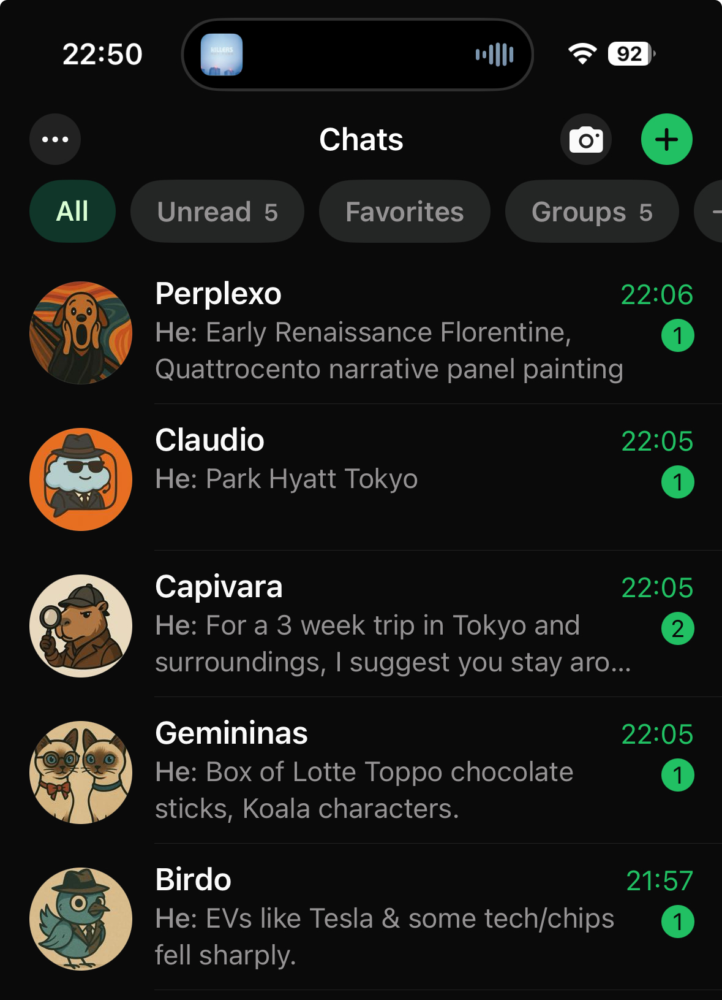

# Hey Neta 👋🏴‍☠️: Your AI Agents, Now on WhatsApp!

**(Your Pocket AI Bridge, Built with Python & Shenanigans)**

Ever wish you could just ping your favorite AI assistant directly from WhatsApp, perhaps even send it a picture you just snapped with your fancy smart glasses? Neta is here to make that happen!

This Python application connects WhatsApp Web to various AI platforms (ChatGPT, Claude, Gemini, Perplexity, Grok) using UI automation or API integration.
It automatically grabs messages and images from your designated WhatsApp chats, sends them to the corresponding AI, and brings back the response.


## The Origin Story ✨🔮

This project was vibe-coded in less than 24 hours, fuelled by mild annoyance.
Why? Because every time I said **"Hey Meta"** to those otherwise cool Ray-Ban Meta glasses, I'd get hit with **"I can't do that on your glasses."**

So I built **Neta**.
Neta will *never* leave you hanging.
You say: _"Hey Neta, send a picture to Capivara,"_ — and like magic, you get exactly what you asked for.
Yeah, **"Hey Neta"** really works 😁.

Some features aren't available everywhere 🌍 — but Neta makes sure your assistants are. Plus, you can pick your favourite AI to power it.

It's fully chat-based because I wanted to make use of the plans I’ve already paid for.

Anyway, cheers.

## ⚠️ Deprecation Notice: Browser Integration

The **browser-based integration** (UI automation via Selenium) is **deprecated** and will be **removed soon** from the codebase.

> 🧼 It was a great hack for fast prototyping, but it's time to clean things up.

Moving forward, **API-based integration is the priority** — it offers **better reliability, performance, and stability** across all supported platforms.


**👉 Meet the Crew (Your AI Agents):**

| Platform    | Neta Agent    | Provider    |
| :---------- | :------------ | :---------- |
| ChatGPT     | Capivara      | OpenAI      |
| Grok        | Birdo         | xAI         |
| Gemini      | Gemininas     | Google      |
| Claude      | Claudio       | Anthropic   |
| Perplexity  | Perplexo      | Perplexity AI|

Curious about the agents? Dive into the [Museum Section](./docs/museum/README.md)!

## 🚨 Important Warnings & Disclaimers 🚨

* **Potential Costs:** Using Neta will utilize your existing subscriptions/credits on the connected AI platforms just as if you were using their websites directly. Any associated costs are your responsibility.
* **AI Built This (Mostly):** This project is proudly ~95% AI-generated and ~5% human-debugged. 🤖👨‍💻 Expect quirks!

## Features

* 🔗 **Connect WhatsApp Web** with multiple AI platforms simultaneously.
* 💬 **Process Text Messages:** Send prompts directly from WhatsApp.
* 🖼️ **Process Image Messages:** Send images from WhatsApp for AI analysis.
* 👓 **Optimized for Readability:** Default settings aim for concise replies suitable for smart glasses or quick reading.

## Architecture

Want to see the setup under the hood? Check out the [ARCHITECTURE.md](docs/ARCHITECTURE.md).

## In Progress ⏰

* 🖼️ Returning images *from* AI chats back to WhatsApp.

## Getting Started: Let the Hacking Begin!

### Prerequisites

* Python 3.10+
* [Poetry](https://python-poetry.org/) (for managing dependencies effectively).
* [pngpaste](https://formulae.brew.sh/formula/pngpaste) installed to be able to upload images.
* Google Chrome browser (Neta needs to control it!).
* **Operating System:** Currently, Neta has only been tested on **macOS**. It *might* work on Linux or Windows with adjustments (especially regarding Chrome profile paths and potentially UI selectors), but this is not guaranteed or supported.

### Installation

1.  **Clone the Repository:**
    ```bash
    git clone https://github.com/leofukui/neta.git
    cd neta
    ```

2.  **Install Dependencies:**
    ```bash
    poetry install
    ```

3.  **Set Up Environment Configuration:**
    ```bash
    cp .env.example .env
    ```
    Now, **edit the `.env` file**. You *must* set your Chrome profile path (`CHROME_PROFILE_PATH`). You can also adjust timing settings here if interactions seem too fast or slow.

4.  **Map Your Chats (AI Configuration):**
    * Look inside the `config/` directory. You'll find JSON files (e.g., `default.json`).
    * These files map a **WhatsApp Chat Name** (case-sensitive!) to an AI platform and its specific UI selectors (used by Neta to find input boxes and response elements).
    * **Edit these files** to match the *exact names* of the WhatsApp chats you want Neta to monitor for each AI.
    * *Example snippet from a config file:*
        ```json
        {
          "Capivara": { // This MUST match your WhatsApp chat name for ChatGPT
            "url": "[https://chat.openai.com/](https://chat.openai.com/)",
            "tab_name": "ChatGPT", // How Neta names the browser tab
            "input_selector": "#prompt-textarea", // CSS selector for the input field
            "response_selector": ".markdown", // CSS selector for the response area
            "agent_enabled": true
          },
          // ... other AI configs
        }
        ```

### WhatsApp & AI Setup

First, I recommend you to have 2 Whatspp accounts, since one will be active all the time. This is how I configured and tested this application.

Use this dedicated Whatsapp when authenticating. Then for each agent you would like to integrate, you add a group with you and this Whatsapp. You can add more than one person even, so many people can interact with your AI :robot:

This is how it looks like on yuour app:

### WhatsApp & AI Setup 📱🤖

First, I recommend having **two WhatsApp accounts**, since one will need to stay active all the time.
This is how I configured and tested the application.

👉 Use a **dedicated WhatsApp** account for authentication. Then, for each agent you want to integrate, create a **group** with you and this dedicated WhatsApp account.
You can even add more people to the group, so multiple users can interact with your AI 🤖!

**Here’s how it looks inside the app 😃**

<p align="center">
  
</p>

#### Instructions

1.  **Name Your Chats:** Ensure the WhatsApp chats you intend to use have the *exact same names* as the keys in your JSON configuration file (e.g., "Capivara", "Birdo", "Gemininas"). Tip: Create WhatsApp groups with these exact names.
2.  **Launch Neta:** Run the application (see Usage section below).
3.  **Scan QR Codes:**
    * First, Neta will open WhatsApp Web. Scan the QR code with your phone to log in.
    * Then, Neta will open tabs for *each enabled AI platform* specified in your config. You will likely need to **manually log in** to each of these AI services in their respective browser tabs the first time (and whenever your sessions expire). Neta requires active sessions to function!

### Sending Messages from Smart Glasses (e.g., Ray-Ban Meta)

1.  Using your smart glasses, initiate sending a message or picture via WhatsApp to the specific chat Neta is monitoring for your chosen AI agent.
    * Example voice command: *"Hey Neta, send a picture on WhatsApp to Capivara."* (Replace "Capivara" with the actual chat name/agent name you've configured).
2.  Receive the AI's response (e.g., image description) via your glasses' audio.

## Usage

```bash
# Run Neta with the default configuration (config/default.json)
poetry run neta

# Run with a specific configuration file
poetry run neta --config path/to/your/custom_config.json

# Increase logging verbosity and save to a file
poetry run neta --log-level DEBUG --log-file logs/neta_debug.log
