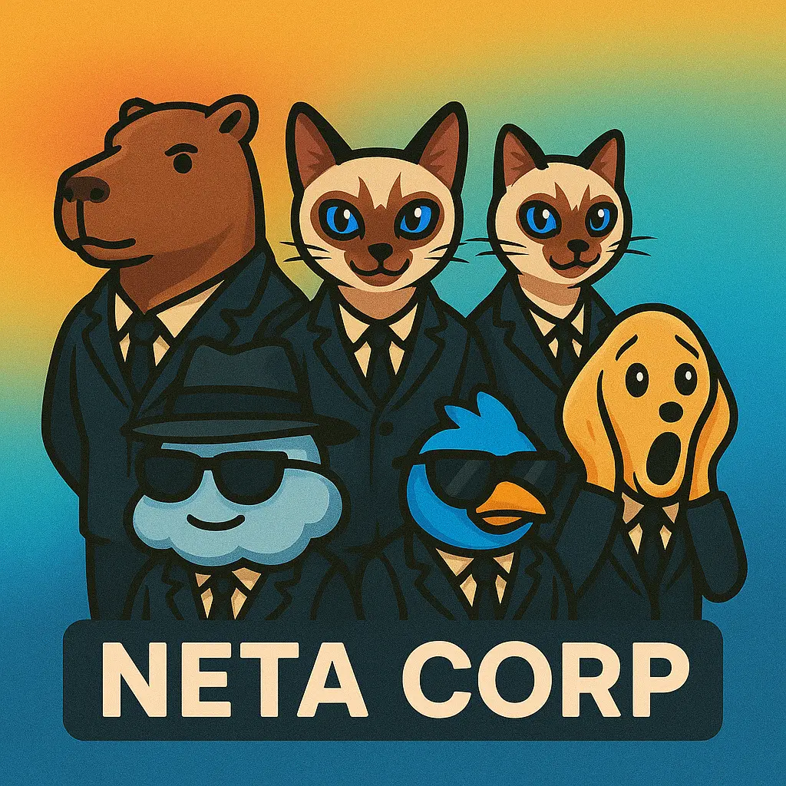
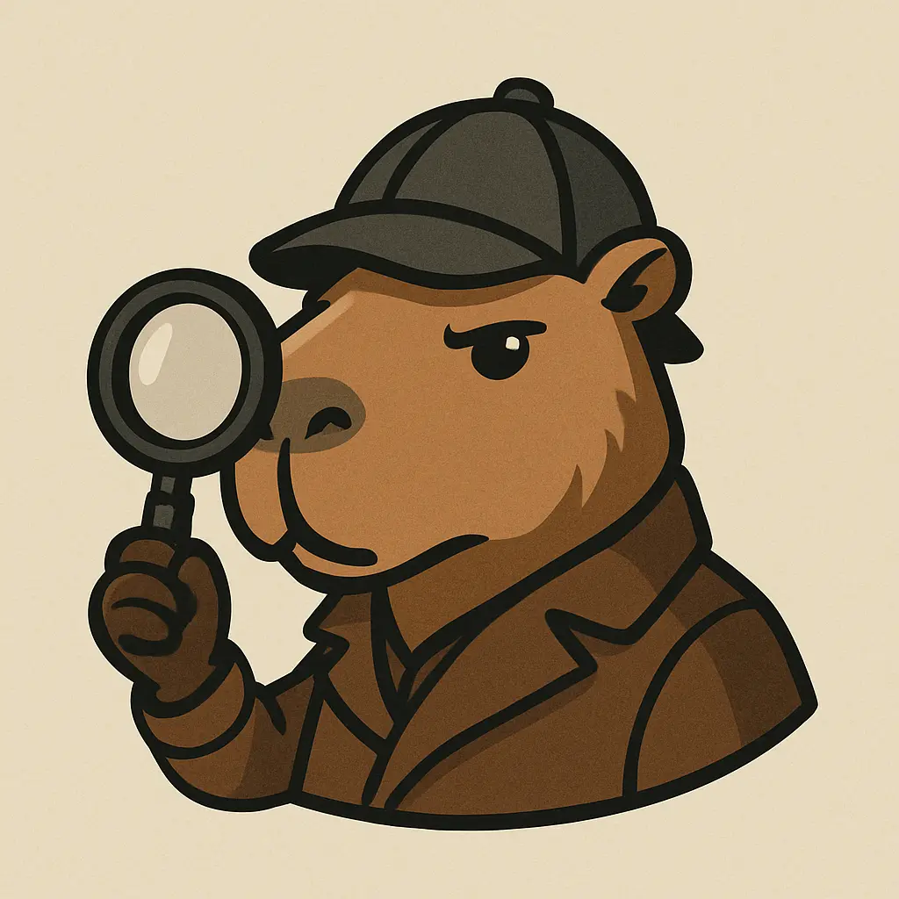
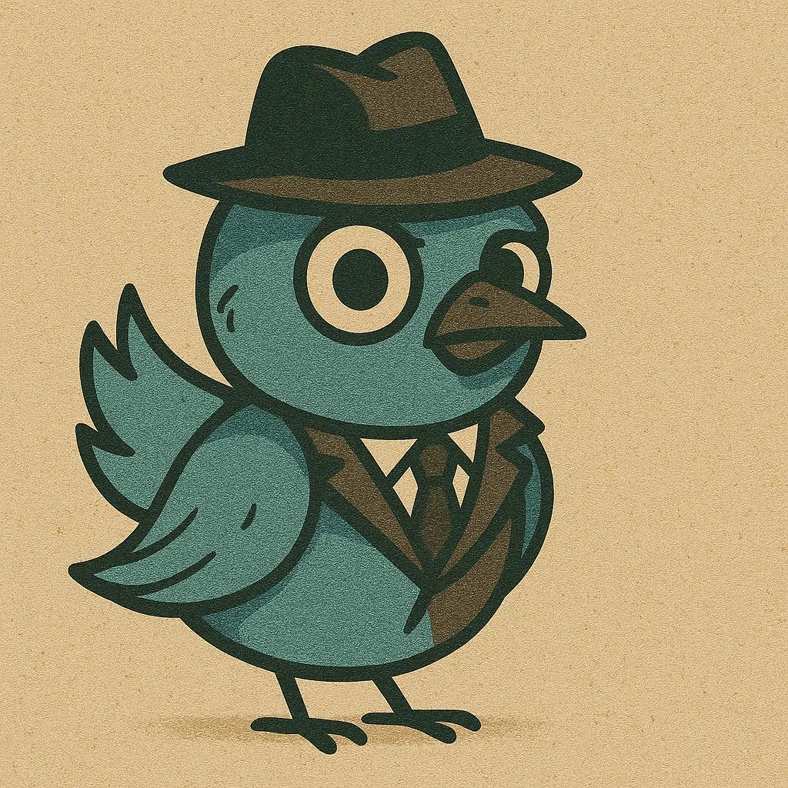
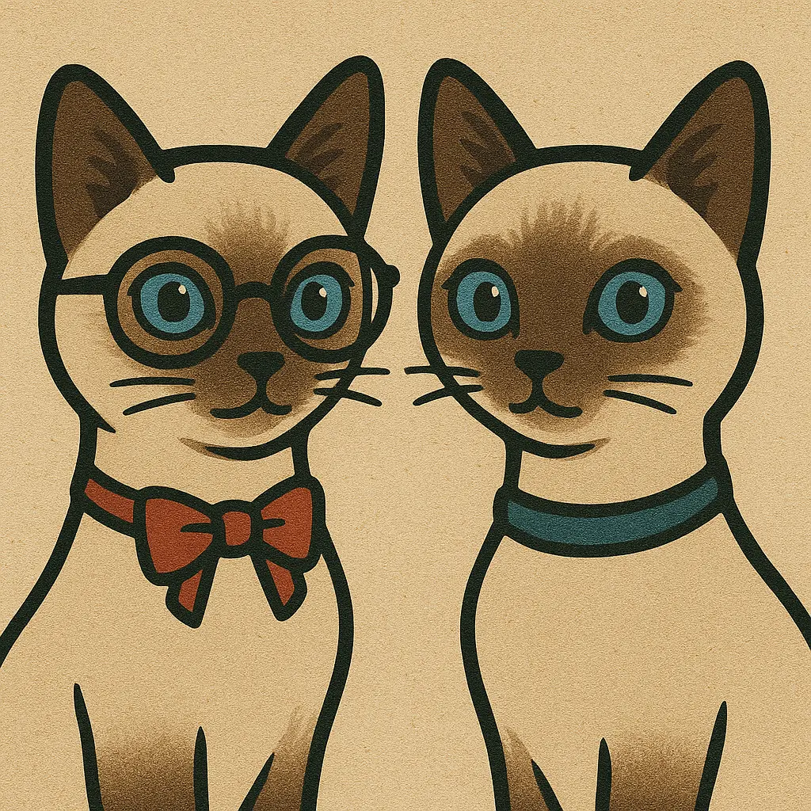
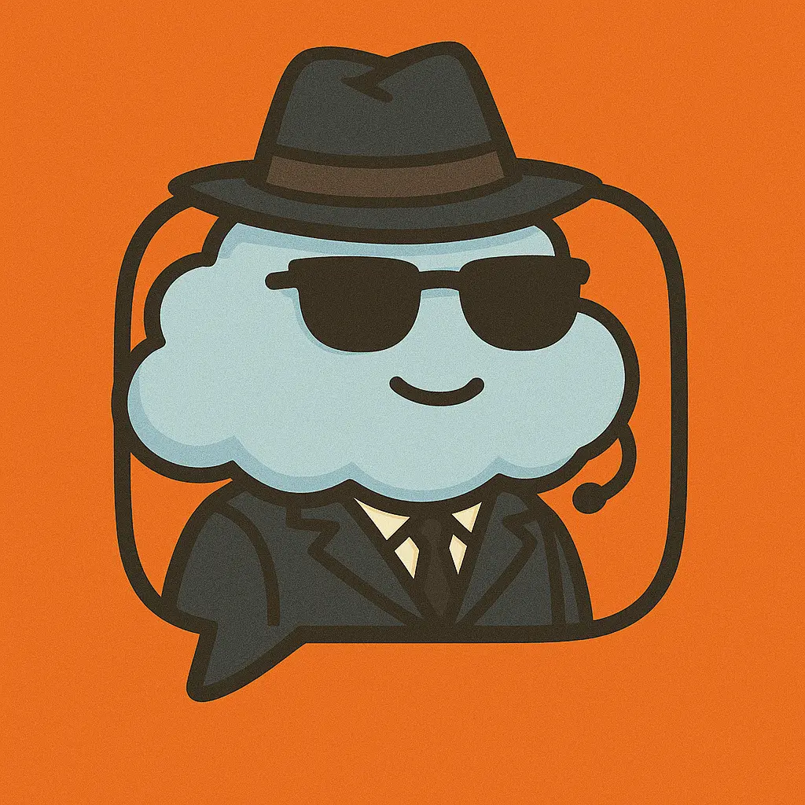

# Neta Corp Museum

<table>
<tr>
<td align="center"></td>
</tr>
</table>

Each agent is responsible for one AI chat.

| Platform  | Neta Agent | Provider       |
| :-------- | :--------- | :------------- |
| ChatGPT   | Capivara    | OpenAI          |
| Grok      | Birdo       | xAI             |
| Gemini    | Gemininas   | Google          |
| Claude    | Claudio     | Anthropic       |
| Perplexity| Perplexo    | Perplexity AI   |

This file is like a hall of fame for our sweet agent creatures.

The images below can be used to build your Whatsapp chats.

---

### **Capivara: GPT agent**

In Portuguese, we say "puxar a capivara" - pull the capivara - when we want to get details about someone.

This is the inspiration for Capivara. They will find all the details.

<table>
<tr>
<td align="center"></td>
</tr>
</table>

---

### **Perplexo, Perplexity agent**

Perplexo is always surprised by reality.

They only collect info from trustworthy sources, so he is always shocked about how real and harsh things can be.

<table>
<tr>
<td align="center"></td>
</tr>
</table>

---

### **Birdo, Grok agent**

He is an unemployed agent laid off from a famous social network.

Once very influential in his previous position, he still has contacts within the company, which allows him a bridge to this AI.

<table>
<tr>
<td align="center"></td>
</tr>
</table>

---

### **Gemininas, Gemini agents**

They are very cute cats, Monica and Magali, inspired by two lovely cats.

<table>
<tr>
<td align="center"></td>
</tr>
</table>

*(Self-promotion: When you download this package, you receive a free picture of the real cats! Find it [here](./agents/Monica-and-Magali.jpg))*

---

### **Claudio, Claude agent**

Claudio Computing is a reliable cloud agent; he is always there for you when you need him.

<table>
<tr>
<td align="center"></td>
</tr>
</table>

---

### Initial prompt

Here you can find the first prompt that started this project:

```text
# Initial prompt

I want to create a project that will be running in python that will:

- On start open tabs on controlled chrome (playwright maybe)
- These tabs will be opening pages like: grok, open gpt, gemini, claude, perplexity. whatsapp web
- All it will do is to wait for user login in those platforms
- the intention is too, every time this we receive a message in a whatsapp, we go to the proper tab, repass the message (adding, maximum 350 characteres - to make message short).
- After message is loaded it will be copying the response and repassing it to the whatsapp channel.
- We will have a mapping of the group chat and the IA system, so that when I send message to certain channel, it will execute the question in the correct AI.
- I can help with the media queries for the interacitons on AI later if you cant solve that to me.
- This service can be in python, using poetry or a moderm better tool

This is a personal project, just for fun.
